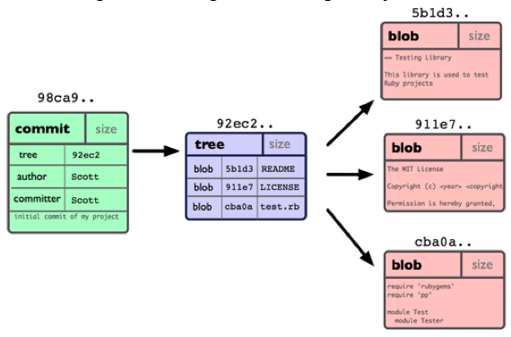
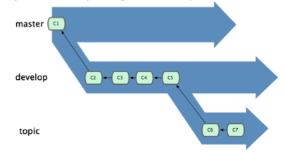
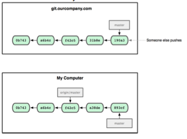
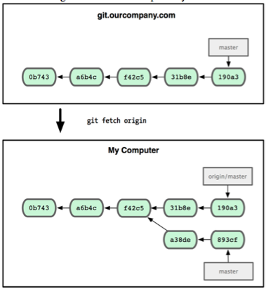
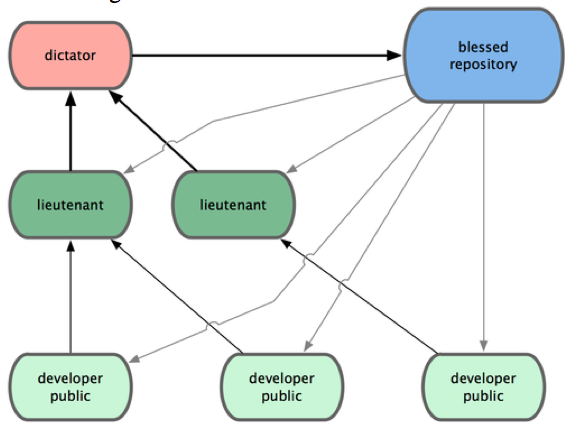

#[Pro Git][1]

## 1.3 Git Basics
> The major difference between Git and any other VCS (Subversion and friends included) is the way Git thinks about its data.

Most other systems store information as a list of file-based changes. Git thinks of its data more like **a set of snapshots** of a mini **filesystem**

> Git has **Integrity**.

Everything in Git is check-summed before it is stored and is then referred to by that checksum. Checksum is a 40-character string composed of hexadecimal characters and calculated by the SHA-1 algo. 

The three states:

1. modified
2. staged
3. committed 


## 1.5 Git Config

Configure files:

* /etc/gitconfig
	* git config --system
* ~/.gitconfig
	* git config --global
* .git/config

Check settings: `git config --list`

## 1.6 Git Help

* `git help <verb>`
* `git <verb> --help`
* `man git-<verb>`

## 2.2.3 Staging Modified Files

`git add <FILE>`, BANG!

**Note**:the status of a file can be both staged and unstaged. If it is committed now, the version of the file is the version of the staged file, not the one currently working on.

Git can also stage certain parts of a file, that is **stage patch**. Check interactive staging: `git add -i`.

## 2.2.4 ignoring files

Sample **.gitignore** file:

```
# a comment  this is ignored
*.a       # no .a files
!lib.a    # but do track lib.a, even though you’re ignoring .a files above
/TODO     # only ignore the root TODO file, not subdir/TODO
build/    # ignore all files in the build/ directory
doc/*.txt # ignore doc/notes.txt, but not doc/server/arch.txt
```
## 2.2.5 Viewing Staged and Unstaged Changes

Roughly: `git status`.

Details: 

* changes of not staged: `git diff`
* staged changes: `git diff --cached` or `git diff --staged` for Git version >= 1.6.1

## 2.2.7 Skipping the Staging Area

`git commit -a` will automatically stage every file that is tracked.

## 2.2.8 Removing Files

Delete file **permanently**: `git rm <FILE>`

Stop tracking file: `git rm --cached <FILE>`, that is to remove it from the staging area.

**NOTE**: `git rm` supports file-glob: `git rm log/\*.log`. The backslash(\\) is needed because Git does its own filename expansion.

## 2.3 Viewing Commit History

Useful `git log` **options**:

### `git log -p -2`

`-p`: show diff in each commit.

`-2`: limit the output to the latest 2 commits.

### `git log --stat`

Show abbreviated status for each commit.

### `git log --pretty[=oneline|short|full|fuller]`

Show commits with less or more information.

### `git log --pretty=format:"%h - %an, %ar : %s"`

The selected list of format options:

| Option | Description of Output   |
|:------ |:---------------------   |
| %H     | Commit hash             |
| %h     | Abbreviated commit hash |
| %T     | Tree hash               |
| %t     | Abbreviated tree hash   |
| %P     | Parent hashes
| %p     | Abbreviated parent hashes
| %an    | Author name
| %ae    | Author e-mail
| %ad    | Author date (format respects the date= option) 
| %ar    | Author date, relative
| %cn    | Committer name
| %ce    | Committer email
| %cd    | Committer date
| %rr    | Committer date, relative
| %s     | Subject

**NOTE**: For "%s" option, check the [bug of zsh][zsh-bug].

### `git log --graph`

`--graph` option will show branch and merge history.


Check [A pretty format with color][git-log-format]

### 2.3.1 Limiting Log Output

Limit options:

| Option | Description |
|:------ |:----------- |
| -\<n\>   | show last n commits |
| --since, --after | ... |
| --author | … |
| --committer | … |
| --grep | search for keywords in the commit messages |

**NOTE**: if using `--author` and `--grep` at the same time, you have to add `--all-match`, or the command will match commits with either.

## 2.4 Undoing Things

### Changing Last Commit

`git commit --amend`

**NOTE**: check [Learn GIt Branching][2] for changing some commit in the history.

### Unstaging a Staged File

`git reset HEAD <FILE>` as `git status` indicates.

### Unmodifying a Modified File

`git checkout -- <FILE>` as `git status` indicates.

## 2.6 Tagging

### Listing Tags

`git tag`

`git tag -l 'v1.4.*'`

### Creating Tags

There're 2 types of tags:

* **lightweight**
	* `git tag v1.4.1`
* **annotated**
	* `git tag -a v1.4.1 -m "Hello World"`
	* `git tag -s v1.4.1 -m "signed tag"` to sign tag with GPG

#### Verify signed tags

`git tag -v v1.4.1`. It needs the signer's public key in the keyring.

#### Show tag info

`git show v1.4.1`

#### Tagging past commit

`git tag v1.4.1 9fceb02`

### Sharing Tags

By default, git doesn't transfer tags to remote servers. Explicitly push tags to a shared server: `git push origin v1.4.1`.

Or push all the tags at once: `git push origin --tags`.

## 2.7 Tips and Tricks

### Git Aliases

```
git config --global alias.co checkout
git config --global alias.br branch
git config --global alias.ci commit
git config --global alias.st status
git config --global alias.unstage 'reset HEAD --'
git config --global alias.last 'log -1 HEAD'
```

[1]: http://git-scm.com/book
[2]: http://pcottle.github.io/learnGitBranching/
[zsh-bug]: https://github.com/robbyrussell/oh-my-zsh/issues/521
[git-log-format]: http://www.jukie.net/bart/blog/pimping-out-git-log

## 3.1 How Git Branch Works?

Single commit repository data:



**NOTE**:Git doesn’t store data as a series of changesets or deltas, but instead as a series of snapshots.

## 3.2.3 Basic Merge Conflicts

`git mergetool` to visually merge conflicts.

## 3.3 Branch Management

`git branch -v` to see the last commit on each branch.

`git branch --merged` to see which branches are already merged into the branch you’re on

* `git branch --no-merged`

## 3.4.1 Long-Running Branches

Keep branches at different levels of stability:


## 3.5 Remote Branches

Initial:



After `git fetch origin`:



## 3.5.1 Pushing

`git push origin serverfix:awesomebranch`: **serverfix** is the local branch name and **awesomebranch** is the branch name on the remote project.

## 3.5.2 Tracking Branches

Tracking branches are local branches that have a directed relationship with a remote branch. 

Checking out a local branch from a remote branch will automatically creates a tracking branch: `git checkout -b sf origin/serverfix`. Now the local branch **sf** will automatically push to or pull from **origin/serverfix**.

If let the local branch use the same name as the remote branch, you can use `--track` option: ``git checkout --track origin/serverfix`.

## 3.5.3 Deleting Remote Branches

`git push origin :awesomebranch`

> A way to remember this command is by recalling the `git push [remotename] [localbranch]:[remotebranch]` syntax that we went over a bit earlier. If you leave off the **[localbranch]** portion, then you’re basically saying, “Take nothing on my side and make it be **[remotebranch]**.”

## 3.6.2 More Interesting Rebases

Full git-rebase command:
`git rebase [-i | --interactive] [options] [--onto <newbase>] [<upstream>] [<branch>]`

**--onto** has the exact same effect as `git reset --hard <upstream>` (or \<newbase>).

Check the example of `git rebase --onto master server client` in the book. It means:

> Check out the client branch, figure out the patches from the common ancestor of the client and server branches, and then replay them onto master.

## 3.6.3 The Perils of Rebasing

> Don't rebase the commits that you have pushed to a public repository.
> Treat rebasing as a way to clean up and work with commits before you push them

## 4 Git on the Server

> A remote repository is generally a bare repository — a Git repository that has no working directory. Because the repository is only used as a collaboration point, there is no reason to have a snapshot checked out on disk; it’s just the Git data. In the simplest terms, a bare repository is the contents of your project’s .git directory and nothing else.

## 4.1 The Protocols

* Local Protocol
* SSH Protocol
	* the only network-based protocol that you can easily read from and write to.
	* **main problem**: People must have access to your machine over SSH to access it(no anonymous access), even in a read-only capacity.
* Git Protocol
* HTTP/S Protocol

## Getting Git on a Server

Export an existing repository into a new bare repository — a repository that doesn’t contain a working directory:
> `git clone --bare my_project my_project.git`

This is roughly equivalent to:
> `cp -Rf my_project/.git my_project.git`

## 4.2.2 Github's SSH Access Setup

Create a single ‘git’ user on the machine, ask every user who is to have write access to send you an SSH public key, and add that key to the /.ssh/authorized keys file of your new ‘git’ user. At that point, everyone will be able to access that machine via the ‘git’ user. 

## 4.6 GitWeb

Simple web-based visualization:

> `git instaweb --httpd=webrick` for OSX or `git instaweb` for Linux
> `git instaweb --httpd=webrick --stop` to stop

## 4.7 Gitosis

Access control for git.

## 5.1.3 Dictator and Lieutenants Workflow

It's generally used by huge projects like the Linux kernel.



## 5.2 Commit Guidelines

### Don't submit any whitespace errors

Use `git diff --check` to check it before really committing.

### Make each commit logically separate changeset

Try to make sure at least one commit per issue. If some of the changes modify the same file, use `git add --patch` to partially stage files.

### Create quality commit message

General rule:

1. Start with a single line with no more than 50 chars to describe the commit;
2. A blank line.
3. A more detailed explanation: motivation for the change and contrast its implementation with previous behavior.

## Some Useful Command

`git push -f origin featureA`: specify the `-f` to your push command in order to be able to replace the **featureA** branch on the server with a commit that isn’t a descendant of it.

`git merge --no-commit --squash featureB`: `--squash` option takes all the work on the merged branch and squashes it into one non-merge commit on top of the branch you’re on. `--no-commit` option tells Git not to automatically record a commit. This allows you to introduce all the changes from another branch and then make more changes before recording the new commit. (check the example in 5.2.4)

`git request-pull origin/master myfork`: The `request-pull` command takes the base branch into which you want your topic branch pulled and the Git repository URL you want them to pull from, and outputs a summary of all the changes you’re asking to be pulled in.

`git format-patch -M origin/master`: You use `git format-patch` to generate the mbox-formatted files that you can e-mail to the list. The `format-patch` command prints out the names of the patch files it creates. The `-M` switch tells Git to look for renames.

`git send-email *.patch`: First set up the imap section in **./.gitconfig** file. You can use `git send-email` to place the patch series in the folder of the specified IMAP server.

## 5.3.1 Working in Topic Branch

If you create a branch name based on the theme of the work you're going to try, you can easily remember it. Besides, **namespacing** the branch also helps, e.g. namespace it by who contribute the work: wy/featureA.

## 5.3.2 Applying Patches from E-mail

### Method1: `git apply`

If you received the patch from someone who generated it with the `git diff` or a Unix `diff` command, you can apply it with the `git apply` command.

`git apply featureA.patch`. **NOTE**: `git patch` won't create a commit for you. You must stage and commit the changes manually.

`git apply --check featureA.patch` to see if a patch applies cleanly before actually applying it.

### Method2: `git am`

If the patch is generated by `format-patch`, you can apply it using `git am`.  If you can, encourage your contributors to use `format-patch` instead of `diff`.

`git am featureA.patch`.

If conflict happens, edit the conflict file to resolve it, stage the file and run `git am --resolved` to continue to the next patch.

More intelligent way to resolve: `-3` option to make Git attempt a three-way merge. **Requisite**: you must have the commit that the patch is based on so that the three-way merge can be done.

If you’re applying a number of patches from an mbox, you can also run the am command in **interactive** mode: `git am -3 -i mbox`.

## 5.3.3 Checking Out Remote Branches

Jessica says she has a great new feature in the **ruby-client** of her repository:

```
$ git remote add jessica git://github.com/jessica/myproject.git
$ git fetch jessica
$ git checkout -b rubyclient jessica/ruby-client
```

If you only need the one-time pull and don't need to remember the remote repository, the `git pull` is also ok: `git pull git://github.com/onetimeguy/project.git`

## 5.3.4 Determining What Is Introduced

`git log featureA --not master`: `--not master` will exclude the commits in the master branch.

**NOTE**: To see a full diff of what would happen if you were to merge this topic branch with another branch, `git diff master` will **not** work. For example, if you’ve added a line in a file on the master branch, a direct comparison of the snapshots will look like the topic branch is going to remove that line.

### Get the common ancestor of two commits

`git merge-base contrib master`. Then compare it with the last commit of the branch you're working on.

or **directly** `git diff master...contrib`. `git diff A…B` is equivalent to  `git diff $(git-merge-base A B) B`.

## 5.3.5 Integrating Contributed Work

* Merging Workflows
	* master, develop branch
* Large-Merging Workflows
	* Several long-running branches: e.g. master, next, pu, maint.
* Rebasing and Cherry Picking Workflows

## 5.3.6 Tagging Your Releases

How to distribute the public PGP key used to sign your tags:

1. Export the GPG key
2. `git hash-object` to write a new blob with the content of the key
3. tag the key in the repo
4. share the GPG key via the blob in the repo, just pulling the blob out and import it into GPG

## 5.3.7 Generating a Build Number

```
$ git describe master
v1.6.2-rc1-20-g8c5b85c
```

{nearest_tag}-{number_of_commits}-{partial_SHA1_value}

## 5.3.8 Preparing a Release


```
$ git archive master --prefix='project/' | gzip > `git describe master`.tar.gz
$ ls *.tar.gz
v1.6.2-rc1-20-g8c5b85c.tar.gz
```
or

```
$ git archive master --prefix='project/' --format=zip > `git describe master`.zip
```

## 5.3.9 The Shortlog

the following gives you a summary of all the commits since your last release, if your last release was named v1.0.1:

```
$ git shortlog --no-merges master --not v1.0.1
Chris Wanstrath (8):
      Add support for annotated tags to Grit::Tag
      Add packed-refs annotated tag support.
      Add Grit::Commit#to_patch
      Update version and History.txt
      Remove stray ‘puts‘
      Make ls_tree ignore nils
Tom Preston-Werner (4):
      fix dates in history
      dynamic version method
      Version bump to 1.0.2
      Regenerated gemspec for version 1.0.2
```

## 6.1.2 Short SHA

If you pass `--abbrev-commit` to the git log command, the output will use shorter values but keep them unique.

## 6.1.4 Branch References

See which specific SHA a branch points to: `git rev-parse topic1`.

## 6.1.5 RefLog Shortnames

**RefLog** — a log of where your HEAD and branch references have been for the last few months.

See RefLog: `git reflog`. Check some specific log: `git show HEAD@{5}`.

Time restrict: `git show master@{yesterday}`.

See reflog formatted like the `git log` output:

```
$ git log -g master
commit 734713bc047d87bf7eac9674765ae793478c50d3
Reflog: master@{0} (Scott Chacon <schacon@gmail.com>)
Reflog message: commit: fixed refs handling, added gc auto, updated
Author: Scott Chacon <schacon@gmail.com>
Date:   Fri Jan 2 18:32:33 2009 -0800
    fixed refs handling, added gc auto, updated tests

commit d921970aadf03b3cf0e71becdaab3147ba71cdef
Reflog: master@{1} (Scott Chacon <schacon@gmail.com>)
Reflog message: merge phedders/rdocs: Merge made by recursive.
Author: Scott Chacon <schacon@gmail.com>
Date:   Thu Dec 11 15:08:43 2008 -0800
    Merge commit ’phedders/rdocs’
```

## 6.1.7 Commit Ranges


### Double Dot

`master..experiment`: all commits reachable by **experiment** that aren’t reachable by **master**.

### Multiple Points

These three commands are equivalent:

```
$ git log refA..refB
$ git log ˆrefA refB
$ git log refB --not refA
```

This is nice because with this syntax you can specify more than two references in your query, which you cannot do with the double-dot syntax. For instance, if you want to see all commits that are reachable from refA or refB but not from refC, you can type one of these:

```
$ git log refA refB ˆrefC
$ git log refA refB --not refC
```

### Triple Dot

Specifies all the commits that are reachable by either of two references but not by both of them:

```
$ git log master...experiment
F
E
D
C
```

A common switch to use with the log command in this case is --left-right, which shows you which side of the range each commit is in. This helps make the data more useful:

```
$ git log --left-right master...experiment
<F
<E
>D
>C
```
## 6.3 Stashing

> Stashing takes the dirty state of your working directory — that is, your modified tracked files and staged changes — and saves it on a stack of unfinished changes that you can reapply at any time.

When the working directory is dirty, you can't switch branches.

### Commands

`git stash`: stash the current working dir.

`git stash list`: list all the stashes done previously.

`git stash apply [STASH-ID]`: reapply the stash to the current working dir, if `[STASH-ID]` is omitted, the latest stash will be applied.

**NOTE**: Having a clean working directory and applying it on the same branch **aren’t** necessary to successfully apply a stash.

`git stash apply --index`: For `git stash apply`, the changes to your files were reapplied, but the file you staged before wasn’t restaged. To do that, you must run the git stash apply command with a --index option to tell the command to try to reapply the staged changes.

`git stash drop`: `git stash apply` only apply stash, but don't remove it. This command will do it.

`git stash pop`: apply and drop.

## 6.3.2 Creating a Branch from a Stash

It's helpful when conflicts happen to `git stash apply`.

`git stash branch BRANCH-NAME [STASH-ID]`: Creates a new branch for you, checks out the commit you were on when you stashed your work, reapplies your work there, and then drops the stash if it applies successfully

## 6.4.2 Changing Multiple Commit Messages

`git rebase -i HEAD ̃3`: **Note** that these commits are listed in the **opposite** order than you normally see them using the log command.(When rebasing, apply the commits top to bottom)

## 6.4.5 Splitting a Commit

In `git rebase -i HEAD~3`, change the instruction on the commit to **edit**.

```
pick f7f3f6d changed my name a bit
edit 310154e updated README formatting and added blame
pick a5f4a0d added cat-file
```

When you save and exit the editor, Git rewinds to the parent of the first commit in your list, applies the first commit (f7f3f6d), applies the second (310154e), and drops you to the console. 

```
$ git reset HEADˆ
$ git add README
$ git commit -m ’updated README formatting’
$ git add lib/simplegit.rb
$ git commit -m ’added blame’
$ git rebase --continue
```

## 6.4.6 The Nuclear Option: filter-branch

Rewrite a larger number of commits in some scriptable way — for instance, changing your e-mail ad- dress globally or removing a file from every commit. 

**NOTE**: you probably shouldn’t use it unless your project isn’t yet public and other people haven’t based work off the commits you’re about to rewrite.

### Removing a File from Every Commit

`git filter-branch --tree-filter ’rm -f passwords.txt’ HEAD`: The `--tree-filter` option runs the specified command after each checkout of the project and then recommits the results.

It’s generally a good idea to do this in a testing branch and then hard-reset your master branch after you’ve determined the outcome is what you really want.

To run `filter-branch` on all your branches, you can pass `--all` to the command.

### Making a Subdirectory the New Root

If you want to make the trunk subdirectory be the new project root for every commit: `git filter-branch --subdirectory-filter trunk HEAD`.

### Changing E-Mail Addresses Globally

Use `--commit-filter` to go through and rewrite every commit.

```
$ git filter-branch --commit-filter ’
        if [ "$GIT_AUTHOR_EMAIL" = "schacon@localhost" ];
        then
                GIT_AUTHOR_NAME="Scott Chacon";
                GIT_AUTHOR_EMAIL="schacon@example.com";
                git commit-tree "$@";
        else
                git commit-tree "$@";
fi’ HEAD
```

## 6.5 Debugging with Git

## 6.5.1 File Annotation

If you track down a bug in your code and want to know when it was introduced and why, file annotation is often your best tool. It shows you what commit was the last to modify each line of any file.

you can annotate the file with `git blame` to see when each line of the method was last edited and by whom.

`git blame -L 12,22 simplegit.rb`: `-L` option to limit the output to lines 12 through 22

For `git blame` output, the commit SHA-1 starting with **^** means this line is in this file's original commit. 

If you pass `-C` to git blame, Git analyzes the file you’re annotating and tries to figure out where **snippets of code within it originally came from** if they were copied from elsewhere.

## 6.5.2 Binary Search

The bisect command does a binary search through your commit history to help you identify as quickly as possible which commit introduced an issue.

start:

```
$ git bisect start
$ git bisect bad
$ git bisect good v1.0
```

repeat:

```
$ git bisect good
or $ git bisect bad
```
until finding the first bad commit.

**NOTE**: When you’re finished, you should run `git bisect reset` to reset your HEAD to where you were before you started.

Automate this process:

```
$ git bisect start HEAD v1.0
$ git bisect run test-error.sh
```

`test-error.sh` is a script that test the project and exit 0 if the project is good or non–0 if the project is bad.

## 6.6 Submodules

Scenarios: you want to be able to treat the two projects as separate yet still be able to use one from within the other.

## 6.6.1 Create Submodules

`git submodule add git://github.com/chneukirchen/rack.git rack`: add external project **rack** as submodules.

Git doesn’t track submodule's contents when you’re not in that directory. Instead, Git records it as a particular commit from that repository. 

When commit the project, you'll see 160000 mode for the submodule entry.

## 6.6.2 Cloning a Project with Submodules

`git clone git://github.com/schacon/myproject.git`: but the submodule directory will be empty.

To get the submodule:

1. `git submodule init` to initialize;
2. `git submodule update` to fetch all the data from the project and **check out appropriate commit listed in your superproject**.

Now the submodule subdirectory is at the exact state it was in when you committed earlier. 

### Merge with other's work

Two steps:

1. Update the point the submodule commit in superproject;
2. update the content of the submodule to the version the superproject points to;

For 1, by `git merge origin/master`, it only merges a change to the pointer for your submodule; but it doesn’t update the code in the submodule directory.

For 2, by `git submodule update`, it'll update the content of the submodule to the correct version.

**One common problem** happens when a developer makes a change locally in a sub- module but doesn’t push it to a public server. Then, they commit a pointer to that non-public state and push up the superproject. When other developers try to run git submodule update, the submodule system can’t find the commit that is referenced, be- cause it exists only on the first developer’s system. If that happens, you see an error like this:

## 6.6.4 Issues with Submodules

* The submodule is detached. The second `git submodule update` will overwrite the previous changes, which has no branch pointing to and won't be found.
	* Create a branch when you work in a submodule directory.
* Switching branches with submodules in them can also be tricky. If you create a new branch, add a submodule there, and then switch back to a branch without that submodule, you still have the submodule directory as an untracked directory.
	* You have to either move it out of the way or remove it, in which case you have to clone it again when you switch back—and you may lose local changes or branches that you didn’t push up.
* switching from subdirectories to submodules.
	* first, unstage the submodule directory
	* then, add the submodule by `git submodule add …`
	* If you want to switch to another branch where those files are still in the actual tree rather than a submodule, you need to move the rack submodule directory out of the way by `mv SUBMODULE-DIR /tmp/`. When you switch back, you can either run `git submodule update` to reclone, or you can move your /tmp/SUBMODULE-DIR  directory back into the empty directory.
	
## 6.7 Subtree Merging

Merging strategy:

1. recursive strategy
2. octopus strategy
3. subtree merge

The idea of the subtree merge is that you have two projects, and one of the projects maps to a subdirectory of the other one and vice versa.

Suppose **Rack** is the submodule project.

You want to pull the Rack project into your master project as a subdirectory: `git read-tree --prefix=rack/ -u rack_branch`

### Merge changes from Rack

```
$ git checkout rack_branch
$ git pull
$ git checkout master
$ git merge --squash -s subtree --no-commit rack_branch
```


### diff between current **rack** subdirectory and the `rack_branch` branch

```
$ git diff-tree -p rack_branch
```

### diff between current **rack** subdirectory and the master branch on the server 

```
$ git diff-tree -p rack_remote/master
```

## 7.1.1~4 Client Configuration

All the options your version of Git recognizes: `git config --help`.

### Some Selected Config

* `core.editor`
* `commit.template`
* `core.pager`
* `user.signingkey`
* `core.excludesfile`
* `help.autocorrect`
    * Only available in Git 1.6.1
* Colors
    * `color.ui true|false|always`
    * `color.*`
        * Specific coloring settings
* Merge and Diff Tools
    * `git config --global merge.tool kdiff3`
    * check 7.1.3 to Setup External Merge and Diff Tools
* Formatting and Whitespace
    * `core.autocrlf false|true|input`
    * Explanation: [mind the end of your line](http://timclem.wordpress.com/2012/03/01/mind-the-end-of-your-line/) and [best strategy handling crlf](http://stackoverflow.com/questions/170961/whats-the-best-crlf-handling-strategy-with-git)
* Whitespace
    * `core.whitespace …`
        * `trailing-space` and `space-before-tab` turned on by default
        * `indent-with-non-tab` and `cr-at-eol` turned off by default
    * Fix whitespace problem when applying patches or rebasing with `--whitespace=fix` option. Or just warn you with `--whitespace=warn`.

## 7.1.5 Server Configuration

### Some Selected Config

* `receive.fsckObjects true|false`
* `receive.denyNonFastForwards true|false`
* `receive.denyDeletes true|false`

## 7.2 Git Attributes

Git attributes are set either in a `.gitattributes` file in one of your directories (normally the root of your project) or in the `.git/info/attributes` file if you don’t want the attributes file committed with your project.

## 7.2.1 Binary Files

### Identifying Binary Files

Set Xcode project file **.pbxproj** as binary file in `.gitattributes`: `*.pbxproj -crlf -diff` or `*.pbxproj binary` if Git version >= 1.6

### Diffing Binary Files

How to: tell git how to convert your binary data into a text format.

#### Example1: word

Use `strings` as the converting program: 

1. add `*.doc diff=word` to `.gitattributes` file so that all doc files will use word filter;
2. set the word-to-text converting program: `git config diff.word.textconv strings`

#### Example2: Image

Extract the EXIF data as the text:

```
$ echo ’*.png diff=exif’ >> .gitattributes
$ git config diff.exif.textconv exiftool
```

## 7.2.2 Keyword Expansion

By default, Git can't do keyword expansion as SVN do, because it checksums the file in the first place. However, you can inject a filter program to do keyword expansion.

Firstly, you can inject the SHA–1 checksum of a blob into an `$Id$` field in the file automatically. Git will identify the `$ID$` keyword.

Secondly, there're two kinds of filters: clean(commit) and smudge(checkout). Setup in `.gitattributes`: `date*.txt filter=dater`

Config `dater` filter:

```
$ git config filter.dater.smudge expand_date
$ git config filter.dater.clean ’perl -pe "s/\\\$Date[ˆ\\\$]*\\\$/\\\$Date\\\$/"’
```

Sample `expand_date` script:

```
#! /usr/bin/env ruby
data = STDIN.read
last_date = ‘git log --pretty=format:"%ad" -1‘
puts data.gsub(’$Date$’, ’$Date: ’ + last_date.to_s + ’$’)
```

## 7.2.3 Exporting Your Repository

So some interesting things when exporting an archive of your project.

### `export-ignore`

Ignore some files or directories. Example of ignoring **text** directory: `test/ export-ignore` in `.gitattributes` file.

### `export-subst`

Some simple keyword substitution before archiving.

Example: Git lets you put the string `$Format:$` in any file with any of the `--pretty=format` formatting shortcodes:

```
$ echo ’Last commit date: $Format:%cd$’ > LAST_COMMIT
$ echo "LAST_COMMIT export-subst" >> .gitattributes
$ git add LAST_COMMIT .gitattributes
$ git commit -am ’adding LAST_COMMIT file for archives’
```

### 7.2.4 Merge Strategies

One very useful option is to tell Git to not try to merge specific files when they have conflicts: `database.xml merge=ours` in `.gitattributes`.

## 7.3 Git Hooks

Like many other Version Control Systems, Git has a way to fire off custom scripts when certain important actions occur. There're two kinds of hooks: client-side hook and server-side hook.

## 7.3.1 Installing a Hook

Hooks(scripts) are stored in the `./.git/hooks` directory. By default, therein exist several samples.

## 7.3.2 Client-Side Hooks

### Commit-Workflow Hooks

#### `pre-commit` hook

Run before you even type in a commit message. 

#### `prepare-commit-msg` hook

Run before the commit message editor is fired up but after the default message is created. Tt’s good for commits where the default message is auto-generated

#### `commit-msg` hook

It takes one parameter: the path to a temporary file that contains the current commit message. If this script exits non-zero, Git aborts the commit process.

#### `post-commit` hook

It doesn’t take any parameters, but you can easily get the last commit by running `git log -1 HEAD`. Generally, this script is used for notification or something similar.

###E-mail Workflow Hooks

They're all invoked by `git am` command.

#### `applypatch-msg` hook

A single argument: the name of the temporary file that contains the proposed commit message. Git aborts the patch if this script exits non-zero.

#### `pre-applypatch` hook

Takes no arguments and is run after the patch is applied, so you can use it to inspect or test the snapshot before making the commit.

#### `post-applypatch` hook

You can use it to notify a group or the author of the patch you pulled in that you’ve done so. You can’t stop the patching process with this script.

### Other Client Hooks

#### `pre-rebase`

Usage: disallow rebasing any commits that have already been pushed.

#### `post-checkout`

Usage: setup environment.

#### `post-merge`

Usage: validate some files that are not version-controlled by Git.

## 7.3.3 Server-Side Hooks

#### `pre-receive`

#### `post-receive`

#### `update`

Similar to the `pre-receive` script, except that it’s run once for **each branch** the pusher is trying to update. If the pusher is trying to push to multiple branches, pre-receive runs only once, whereas update runs once per branch they’re pushing to.

## Chapter8 Git and Other Systems

## 8.1 Git and Subversion

### `git svn`

When using git svn, you’re interacting with Subversion. 

**NOTE**: Subversion can have only a single linear history, and confusing it is very easy. It’s generally best to keep your history as linear as possible

### `git svn clone` 

Clone from a svn repo. It's equivalent to `git svn init` + `git svn fetch`.

`-T trunk -b branches -t tags` option tells Git that this Subversion repository follows the basic branching and tagging conventions. Or equivalently, use `-s` option.

### `git svn dcommit`

After locally commit by `git commit`, you can push the changes to svn repo by this command.

**NOTE**: `git svn dcommit` will rewrite your local Git commit to include a unique identifier, which means the SHA-1 of the commit will change. If you want to push to both a Git server and a Sub- version server, you have to push (dcommit) to the Subversion server first, because that action changes your commit data.

### `git svn rebase`

Pull down any changes on the server.

**NOTE**: Unlike Git which requires you to merge upstream work you don't yet have locally before you push, `git svn` makes you do that only if the changes conflict.

So, running git svn rebase every once in a while makes sure your code is always up to date.

## 8.1.8 Switching Active Branches

**NOTE**: the `dcommit` makes your `git merge` result look like you ran `git merge --squash`. To avoid issues, you should delete the local branch after you merge it into trunk.

## 8.1.9 Subversion Commands

#### `git svn log`

1. It works offline;
2. Only show commits that have been committed to the server.

#### `git svn blame`

like `git blame`

#### `git svn info`

Get SVN server info.

#### `git svn create-ignore`

Automatically create corresponding `.gitignore` files for you so your next commit can include them.

#### `git svn show-ignore`

Prints to stdout the lines you need to put in a `.gitignore` file.

## 8.1.10 Git-Svn Summary

Guidelikes:

* Keep a linear Git history that doesn’t contain merge commits made by `git merge`. Rebase any work you do outside of your mainline branch back onto it; don’t merge it in.
* Don’t set up and collaborate on a separate Git server. Possibly have one to speed up clones for new developers, but don’t push anything to it that doesn’t have a `git-svn-id` entry. You may even want to add a `pre-receive` hook that checks each commit message for a `git-svn-id` and rejects pushes that contain commits without it.

## 8.2 Migrating to Git

## 8.2.2 Migrating from Subversion

`git svn clone` will do most of the work, except:

#### author information

Create a file called `users.txt` that has this mapping in a format like this:

```
schacon = Scott Chacon <schacon@geemail.com>
selse = Someo Nelse <selse@geemail.com>
```

Then:

```
$ git-svn clone http://my-project.googlecode.com/svn/ \
      --authors-file=users.txt --no-metadata -s my_project
```

#### `post-import` cleanup

* Move the tags(remote branches) to proper Git tags:

```
$ cp -Rf .git/refs/remotes/tags/* .git/refs/tags/
$ rm -Rf .git/refs/remotes/tags
```

This takes the references that were remote branches that started with tag/ and makes them real (lightweight) tags.

* move the rest of the references under refs/remotes to be local branches:

```
$ cp -Rf .git/refs/remotes/* .git/refs/heads/
$ rm -Rf .git/refs/remotes
```

* push **all** the branches and tags to the server: `git push origin --all`

## 8.2.2 Migrating from Perforce

#### Get tool

Not available by default. Locate in the `contrib` subdir of git source code:

```
$ git clone git://git.kernel.org/pub/scm/git/git.git
$ cd git/contrib/fast-import
```

In this `fast-import` dir, there's a Python script: `git-p4`.

* setup environment

```
$ export P4PORT=public.perforce.com:1666
```

* run `git-p4 clone`

```
$ git-p4 clone //public/jam/src@all /opt/p4import
```

You can do some cleanup, like perforce identifier in msg, by using `git filter-branch`.

## 8.2.4 A Custom Importer

1. Look for an importer online;
2. If none works, use `git fast-import` tool. It reads simple instructions from stdin to write specific Git data.

## Chapter9 Git Internals

## 9.1 Plumbing and Porcelain

The `objects` directory stores all the content for your database.

The `refs` directory stores pointers into commit objects in that data (branches).

The `HEAD` file points to the branch you currently have checked out.

The `index` file is where Git stores your staging area information. 

## 9.2 Git Objects

Tt the core of Git is a simple key-value data store.

### Hash Objects

```
$ echo ’test content’ | git hash-object -w --stdin
$ find .git/objects -type f
.git/objects/d6/70460b4b4aece5915caf5c68d12f560a9fe3e4
```

The subdirectory is named with the **first 2 characters** of the SHA, and the filename is the remaining 38 characters.

### Retrieve Content

```
$ git cat-file -p d670460b4b4aece5915caf5c68d12f560a9fe3e4
test content
```

### Show Object Type

```
$ git cat-file -t 1f7a7a472abf3dd9643fd615f6da379c4acb3e3a
blob
```

## 9.2.1 Tree Objects

All the content is stored as tree and blob objects, with trees corresponding to UNIX directory entries and blobs corresponding more or less to inodes or file contents. 

### Show Tree Object

`git cat-file -p masterˆ{tree}`: masterˆ{tree} syntax specifies the tree object that is pointed to by the last commit on your master branch.

### Create Tree

```
$ git update-index --add --cacheinfo 100644 \
  83baae61804e65cc73a7201a7252750c76066a30 test.txt
```

* `--add` option because the file doesn’t yet exist in your staging area;
* `--cacheinfo` because the file you’re adding isn’t in your directory but is in your database.
* Mode of `100644` means it’s a normal file. `100755` for executable file. `120000` for symbolic link.

```
$ git write-tree
d8329fc1cc938780ffdd9f94e0d364e0ea74f579
$ git cat-file -p d8329fc1cc938780ffdd9f94e0d364e0ea74f579
100644 blob 83baae61804e65cc73a7201a7252750c76066a30    test.txt
```

* `write-tree`(without `-w`) to write the staging area out to a tree.

```
$ git read-tree --prefix=bak d8329fc1cc938780ffdd9f94e0d364e0ea74f579
$ git write-tree
3c4e9cd789d88d8d89c1073707c3585e41b0e614
$ git cat-file -p 3c4e9cd789d88d8d89c1073707c3585e41b0e614
040000 tree d8329fc1cc938780ffdd9f94e0d364e0ea74f579      bak
100644 blob fa49b077972391ad58037050f2a75f74e3671e92      new.txt
100644 blob 1f7a7a472abf3dd9643fd615f6da379c4acb3e3a      test.txt
```

* `read-tree` reads trees into your staging area.
* `--prefix`: read an existing tree into your staging area as a subtree.

## 9.2.2 Commit Objects

Create commit objects:

```
$ echo ’first commit’ | git commit-tree d8329f
fdf4fc3344e67ab068f836878b6c4951e3b15f3d
```

or there's commit directly before it:

```
$ echo ’second commit’ | git commit-tree 0155eb -p fdf4fc3
cac0cab538b970a37ea1e769cbbde608743bc96d
```

This is essentially what Git does when you run the `git add` and `git commit` commands:

* It stores blobs for the files that have changed
* updates the index
* writes out trees
* writes commit objects that reference the top-level trees and the commits that came immediately before them. 

These three main Git objects — the blob, the tree, and the commit — are initially stored in `.git/objects` directory.

## 9.2.3 Object Storage

The format of object is basically header+content:

```
{FILE_TYPE} {CONTENT_LENGTH}\000
{CONTENT}
```

Then compress the whole thing with zlib and write to the `.git/objects` directory.

## 9.3 Git References

All references locates in: `.git/refs/`.

Edit reference:

* Edit `/git/refs/`. Not recommend.
* `git update-ref refs/heads/master {SHA-1}`. Safer way.

`git branch {BRANCH_NAME}`: Git basically runs that `update-ref` command to add the SHA–1 of the **last commit** of the branch you’re on into whatever new reference you want to create.

## 9.3.1 The HEAD

How do you know **last commit** of the branch you’re on? By HEAD.

Locate in `.git/HEAD/`. The HEAD file is a symbolic reference to the branch you’re currently on.

Safely read HEAD: `git symbolic-ref HEAD`.

Safely set HEAD: `git symbolic-ref HEAD refs/heads/test`.

## 9.3.2 Tags

The tag object is very much like a commit object except that a tag object points to a commit rather than a tree. Locate in `.git/refs/tags`.

Set tag: `git update-ref refs/tags/v1.0 {SHA-1}`.

## 9.3.3 Remotes

Locate in `.git/refs/remotes/`. It stores the value you last pushed to that remote for each branch.


